# Git Flow
[//]: https://mermaid.ai/open-source/syntax/gitgraph.html

## main branch

Public version (with docs)

- Will tag every commit with the public version number.
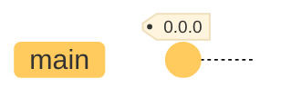

- Won't be merged to any branch.

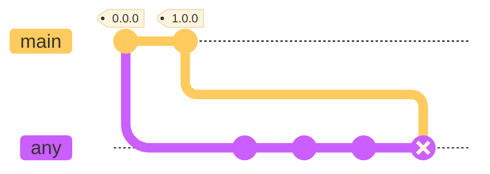

- Will merge only [beta branch](#beta-branch).

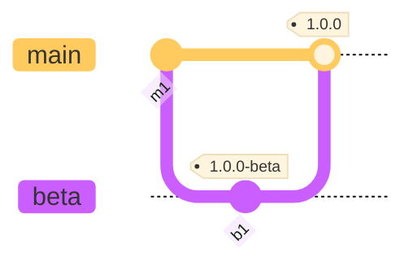

## beta branch
Candidate public version

- Will tag every commit comming from [feature/\<name>](#featurename), [improvement/\<name>](#improvementname), [fix/\<name>](#fixname) branches with the beta version number.

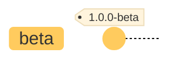

- Can merge:
  - [feature/\<name>](#featurename) - Updates the version to `a+1.0.0`
  - [improvement/\<name>](#improvementname) - Updates the version to `a.b+1.0`
  - [fix/\<name>](#fixname) - Updates the version to `a.b.c+1`
  - [docs/\<name>](#docsname)

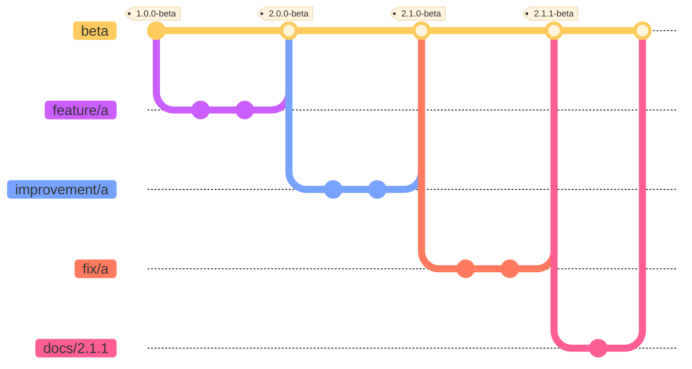

## feature/\<name> branches
New feature
- Can merge [improvement/\<name>](#improvementname) or [fix/\<name>](#fixname) branches

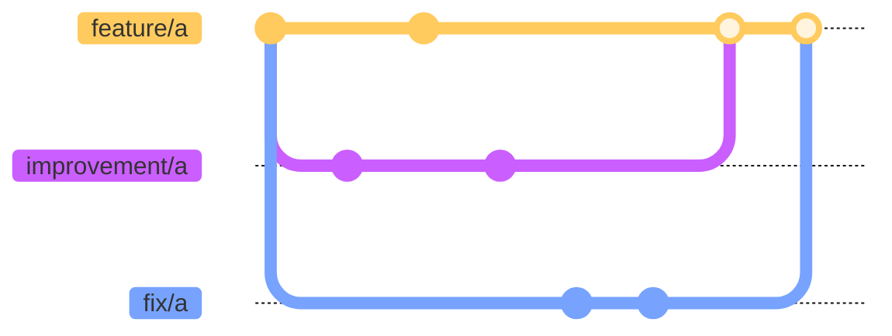

## improvement/\<name> branches
Current code improvements
- Can merge [fix/\<name>](#fixname) branches.
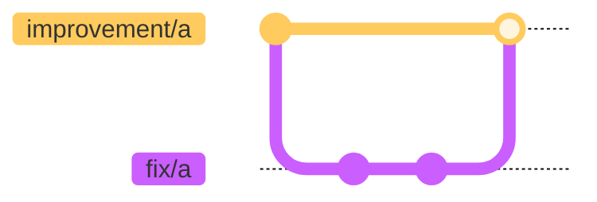

## fix/\<name> branches
Fix current code
- Won't merge any branch
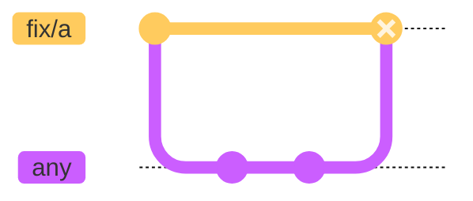

## dev branch
Code that should be released in the next beta doesn't matter which branch will be merged
- Will be merged by feature/<name>, improvement/<name>, fix/<name> branches before beta merge

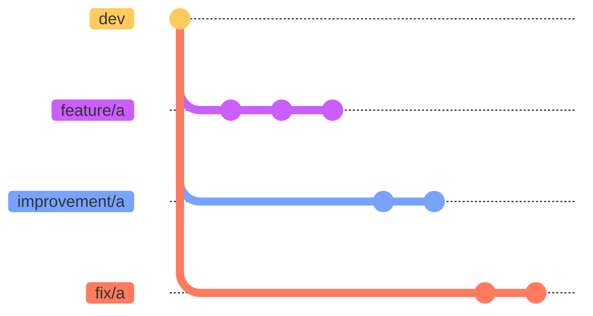

## docs/\<name>
Update documentation and social media
- Will have beta as base branch with the version as branch name

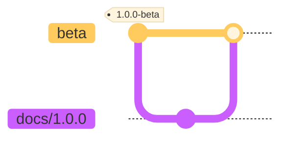

- Won't merge any branch

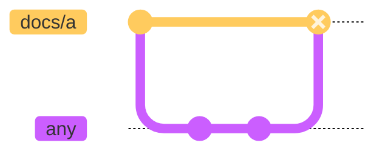